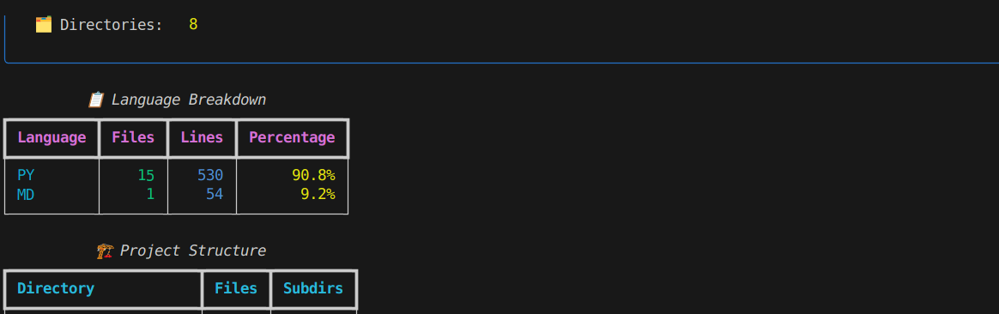
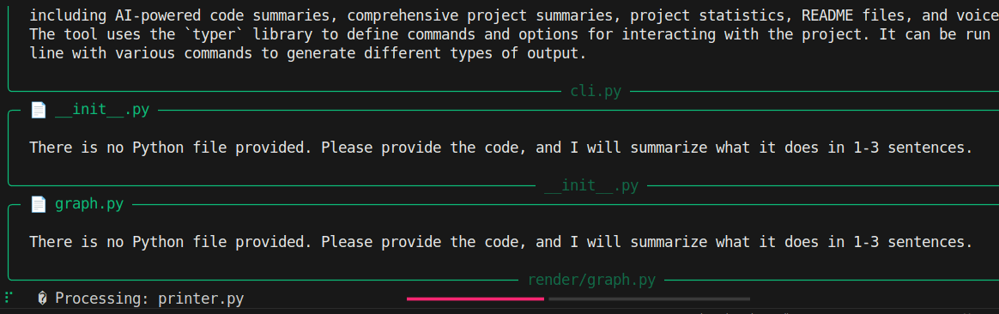
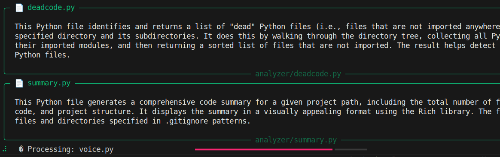
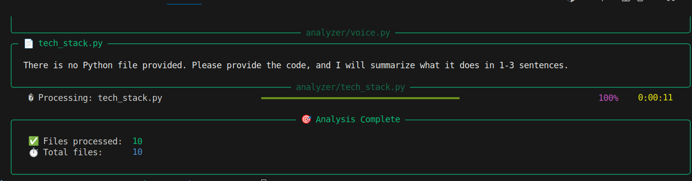
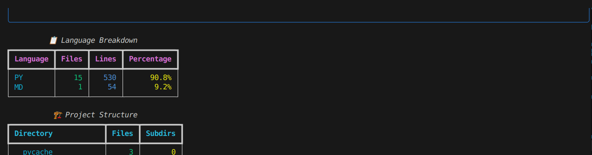

# DevLens

<div align="center">
  
  
  
  **Illuminate Your Codebase with Powerful Analysis**
</div>

## Overview

DevLens delivers comprehensive insights into your codebase, helping teams understand, document, and optimize their software projects with ease.

## Key Features

- **Language Breakdown**: Visualize programming languages distribution
- **Code Metrics**: Analyze lines of code and structural patterns
- **Tech Stack Detection**: Automatically identify frameworks and libraries
- **Dependency Mapping**: Generate interactive graphs of module relationships
- **AI-Powered Documentation**: Get summaries of files, functions, and classes
- **Dead Code Detection**: Identify unused code to improve maintainability
- **README Generator**: Create comprehensive documentation automatically

## Screenshots

<div align="center">
  
  
  
  
</div>

## Getting Started

```bash
# Install DevLens
npm install -g devlens

# Analyze your project
devlens analyze path/to/project
```

DevLens helps engineering teams understand complex codebases quickly and efficiently.